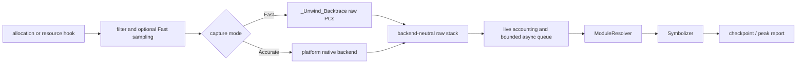

# liballoc_hook

`liballoc_hook.so` is a native allocation tracing library for Android,
OpenHarmony (OHOS), and glibc Linux. It interposes native allocation and
selected resource APIs, records live allocations and raw native PCs, and emits
checkpoint or peak reports.

[中文 README / Chinese README](README.zh-CN.md)

## General hook lifecycle



The interception path performs filtering, accounting decisions, and bounded
native capture only. Module lookup, worker-side `dladdr`, symbolization, and
report formatting stay outside the allocation hook. Successful `malloc`/`new`,
anonymous `mmap`, and selected resource-allocating `ioctl` events share one raw
stack contract; release paths reuse the stored allocation identity.

## Current architecture

The implementation is split into platform-neutral contracts and platform
backends:

- **Capture:** Fast uses bounded `_Unwind_Backtrace` capture when the compiler
  runtime exposes it. Accurate selects an explicit Android, Linux, or OHOS
  backend and preserves partial/error state.
- **Async resolution:** `AsyncStackPipeline` deduplicates raw stacks, snapshots
  loaded ELF modules, resolves dynamic names on a worker, and retains raw and
  module-relative PCs when symbols are unavailable.
- **Report addresses:** captured PCs are return addresses, so every
  module-relative PC in a report is stepped back into the call instruction
  before module lookup. The addresses on `#<n> <addr> <module>` lines are ELF
  virtual addresses of call sites and can be fed straight to
  `llvm-symbolizer --obj=<unstripped-elf>`; each report states the convention on
  its `frame_pc:` line.
- **Accounting:** `PointerData` owns live-allocation identity, sampled host
  accounting, resource accounting, and peak counters.
- **Platform boundaries:** CMake separates OS, libc, architecture, compiler
  unwind capability, and export policy. OHOS `mmap` interposition is opt-in.

See the detailed architecture contract in
[`docs/ARCHITECTURE.md`](docs/ARCHITECTURE.md). The architecture is native
C/C++ and current-thread oriented; managed-runtime stacks, remote-thread
contexts, and complete offline DWARF expansion are optional future capabilities.

## Usage

The same-language usage guide is the entry point for prerequisites, builds,
preload deployment, configuration, checkpoints, troubleshooting, and known
limitations:

[`docs/USAGE.md`](docs/USAGE.md)

The Chinese entry points remain entirely in Chinese:
[`README.zh-CN.md`](README.zh-CN.md),
[`docs/ARCHITECTURE.zh-CN.md`](docs/ARCHITECTURE.zh-CN.md), and
[`docs/USAGE.zh-CN.md`](docs/USAGE.zh-CN.md).

## Configuration

Everything is configured through the two tables below. There are no other
switches: if a behaviour is not listed here, it is not tunable.

### Build options (CMake)

| Option | Default | Effect |
| --- | --- | --- |
| `MALLOC_HOOK_ENABLE_DMA_CAPTURE` | `ON` | Capture DMA-BUF/ION/GPU buffers (`ioctl`/`close` interposition) in addition to `malloc`/`mmap`. Turn off only for host smoke builds with no driver UAPI; on a real device most pipeline memory is DMA, so leaving it off makes the report look empty. |
| `MALLOC_HOOK_OHOS_MMAP_HOOK` | `OFF` | Export `mmap`/`munmap` on OHOS. Off by default to limit loader/vendor interference. |
| `MALLOC_HOOK_BUILD_TESTS` | `ON` | Build the test binaries and register them with CTest. |
| `MALLOC_HOOK_BUILD_GL_TESTS` | `ON` on Android | Build the Android OpenGL integration fixture. |

`linux/dma-heap.h` is used from the sysroot when present; otherwise a vendored
copy of the UAPI is used, so a cross toolchain missing that header still gets
DMA capture. Nothing needs to be set for this.

`build_android.sh`, `build_linux.sh`, and `build_ohos.sh` print the effective
options and derived export policy after a successful build. For a manual CMake
build, run `cmake --build <build-dir> --target print_build_options`.

### Runtime options (environment)

| Variable | Default | Effect |
| --- | --- | --- |
| `DUMP_PEAK_VALUE_MB` | unset | Selects **first-crossing** mode: enables peak recording and dump on exit, and retains a single snapshot, taken the first time the peak criterion passes this many MB. One stack walk for the whole run, so nothing after the crossing stalls an allocating thread. `0` means no floor and selects peak-chasing instead. |
| `ALLOC_HOOK_DUMP_PREFIX` | `/data/local/tmp/trace/backtrace_heap` | Path prefix for reports. Files are named `<prefix>.exit.pid_<pid>.time_<t>.txt`, so a report can always be tied to the process that produced it. |
| `DUMP_PEAK_STEP_MB` | `12` | Peak-chasing mode only: upper bound on the growth required before rebuilding the peak snapshot. For small peaks the code uses 25% growth, with a 64 KB floor; `0` snapshots on every new peak (much more expensive). Unused in first-crossing mode, which never rebuilds. |
| `ALLOC_HOOK_PEAK_SAMPLE_MS` | the interval published by a host framework, else `50` when peak recording is on | Interval for sampling the process's *observed* footprint on a dedicated thread: current `VmRSS` from `/proc/self/status`, dmabuf bytes, and GPU device mappings covered by neither. Their same-sample sum is the peak criterion both modes compare against. Setting it without `DUMP_PEAK_VALUE_MB` selects **peak-chasing** mode, which also enables peak recording and dump on exit. `0` forces the sampler off, leaving the criterion on tracked allocation bytes. |
| `BACKTRACE_MIN_SIZE` | OHOS: `40960`; elsewhere `1024` when peak recording is on, else `0` | Skip stack capture for allocations smaller than this. This is the main cost control: in a typical pipeline it filters >99% of allocations. |
| `ALLOC_HOOK_CAPTURE_MODE` | `fast` | `fast` = bounded raw-PC capture with no symbolization on the allocation thread; the worker may resolve dynamic symbols. `accurate` = OS-specific backend. |
| `ALLOC_HOOK_SAMPLING_INTERVAL_BYTES` | `1` (off) | Poisson-sample host allocations at this byte interval. Scales reported host sizes; does not affect DMA accounting. |
| `ALLOC_HOOK_FAST_CAPTURE_INTERVAL_BYTES` | `1` (off) | Capture a stack only once per this many bytes allocated. Suppresses stacks only; exact size accounting is unaffected. |
| `ALLOC_HOOK_FAST_UNWINDER` | unset | `compiler` forces `_Unwind_Backtrace` instead of the aarch64 frame-pointer walk. The frame-pointer walk is the default because it is cheaper and does not fault on targets whose unwind tables drive libgcc's pointer-authentication path into a `SIGILL`. |
| `BACKTRACE_DUMP_SIGNAL` | `SIGRTMIN+6` (Bionic: `BIONIC_SIGNAL_BACKTRACE`; OHOS: `46`) | Signal that triggers an on-demand report. |
| `ALLOC_HOOK_DEBUG` | unset | Set to anything to emit hook diagnostics (signal, unwind, and ION/DMA paths) on stderr. |

Naming note: the `DUMP_*` and `BACKTRACE_*` variables predate the
`ALLOC_HOOK_*` prefix and are kept as-is because deployment scripts depend on
them.

### The two peak modes

Both modes measure the same criterion -- the observed total, `VmRSS` + dmabuf +
GPU mappings, sampled from `/proc` on a dedicated thread -- and differ only in
which crossing of it they keep the allocation stacks for. Which one runs is
decided by which variable is set:

| Set this | Mode | Snapshot kept | Cost |
| --- | --- | --- | --- |
| `DUMP_PEAK_VALUE_MB=N` | first crossing | the first sample above `N` MB | one stack walk per run |
| `ALLOC_HOOK_PEAK_SAMPLE_MS=k` | peak chasing | the highest sample of the run, refreshed per `DUMP_PEAK_STEP_MB` | one stack walk per step of growth |

First crossing is the cheaper and steadier of the two: after its single walk no
allocating thread is stalled again, which matters when the pipeline being
measured is timing-sensitive. In exchange the stacks describe the floor, not the
maximum, so the floor has to be set near the peak to answer "what is holding
memory at the peak" -- typically from an earlier run's report. Read
`snapshot_lag` to tune it: it is exactly how much higher the floor could have
been set.

Peak chasing needs no such prior knowledge, so a first run gets a correct peak
snapshot straight away, at the cost of a stack walk every time the peak grows
past the step.

Both modes write a report on normal exit and create the report directory if it
does not exist. Setting both variables gives first crossing at the floor, with
the interval you supplied.

#### Cadence

`ALLOC_HOOK_PEAK_SAMPLE_MS` needs no value in the common case. A host framework
that samples this process's memory publishes the interval it uses in a variable
whose name ends in `AUTO_SHOW_MEM_USE_DURATION_MS`; when the hook finds one set
to a positive value it adopts that interval, so the snapshot lands at the instant
such a framework calls the peak and the cadence does not need to be kept in sync
by hand. Failing that, peak recording samples every 50 ms. Setting
`ALLOC_HOOK_PEAK_SAMPLE_MS` explicitly overrides both, including to `0`, which
runs no sampler at all and compares the floor against tracked allocation bytes
instead -- a different quantity, which the report labels as such.

A framework's variable only ever supplies the cadence. It never enables peak
recording on its own: a process that set none of these variables must not gain a
sampler thread and an exit report from its environment.

This does not read the historical `VmPeak` or `VmHWM` fields. They cannot tell
the hook when to copy live stacks. Each sampling cycle instead reads the current
`VmRSS`, then DMA and GPU memory, and compares that same-cycle sum with the
largest sum seen so far. When the sum also crosses the `DUMP_PEAK_VALUE_MB` and
`DUMP_PEAK_STEP_MB` gates, the callback immediately re-reads
`VmRSS`/`RssAnon`/`RssFile`/`RssShmem`, collects the top resident mappings from
`/proc/self/smaps`, and copies the live stack table. These reads and the stack
copy are sequential, not an atomic kernel snapshot; report labels such as
`at_peak` mean the same peak callback window.

For a retained snapshot at every newly observed maximum, a practical explicit
configuration is:

```sh
export ALLOC_HOOK_PEAK_SAMPLE_MS=5   # peak chasing; preferably match the external sampler
export DUMP_PEAK_STEP_MB=0           # exact sampled maximum; higher snapshot cost
export BACKTRACE_MIN_SIZE=1024       # use 0 only when every small stack is required
```

For the single-snapshot mode, with the floor taken from a previous run's peak:

```sh
export DUMP_PEAK_VALUE_MB=300        # first crossing of 300MB; one stack walk
export BACKTRACE_MIN_SIZE=1024
```

Leave `ALLOC_HOOK_SAMPLING_INTERVAL_BYTES` and
`ALLOC_HOOK_FAST_CAPTURE_INTERVAL_BYTES` unset (their effective default is `1`)
when exact host attribution and a stack for every eligible allocation are
required. On a platform with a supported GPU device node the observed criterion
is `rss + dma + gpu`; there is no runtime switch for `rss + dma` while excluding
only that otherwise-unaccounted GPU term.

The report says which watermark the snapshot describes and which criterion
produced it, and — when it was the observed footprint — what that footprint read
at the snapshot instant, what its maximum over the run was, and what the sampler
cost:

```text
peak_retention: chase_max (snapshot refreshed per step)
peak_criterion: observed_host_rss_plus_dma_plus_gpu (from /proc, aligned with an external sampler)
observed_peak(at_snapshot):     rss=291.75MB dma=935.12MB gpu=24.00MB total=1250.87MB
observed_peak(max_of_sum):      rss=291.75MB dma=935.12MB gpu=24.00MB total=1250.87MB (...)
observed_peak(independent_max): rss=369.54MB dma=935.12MB gpu=24.00MB
observed_sampler: interval_ms=1 achieved_ms=1.58 dma_source=fd+maps gpu_source=smaps samples=9516 ...
```

`at_snapshot` equal to `max_of_sum` is the goal state: the stacks were captured
at the maximum, not at some earlier step of it. In first-crossing mode they are
not equal by design, and `snapshot_lag` names the difference:

```text
peak_retention: first_crossing floor=200.000000MB (single snapshot; step unused)
snapshot_lag: observed=+117.800781MB (of 323.628906MB peak)
```

A run whose floor was never reached has no snapshot at all. Rather than emit an
empty stack section, which reads as a hook that captured nothing, the report
falls back to the live allocations at report time and says so:

```text
peak_snapshot: none (criterion never passed the floor; the list above is live at report time)
peak_criterion: none (nothing was snapshotted)
``` `achieved_ms` above the
requested interval means the `/proc` reads cost more than the interval and the
sampler throttled itself to stay under half a core — it never silently claims a
cadence it did not reach. `independent_max` is higher than any single part of
`max_of_sum` whenever host and device memory peak at different moments, which is
the situation this whole mechanism exists for.

`gpu` is device memory a driver mmap'd from a character device instead of handing
out a dmabuf, and mapped PFN/IO rather than with struct pages behind it. Such a
region escapes `rss` and `dma` simultaneously — it is not a dmabuf, and the
kernel excludes PFN/IO pages from `VmRSS` because there is no page to account —
so before it was added the sum here was short by exactly that amount against an
external sampler reporting the same three parts. It is read from
`/proc/self/smaps` as per-region `Size - Rss`, so a region the kernel *does*
count in `VmRSS` contributes only the part `rss` does not already hold.

Three things this cannot do. The sampler reads `/proc`, so it sees the process at
sample instants only; a peak that exists for less than one interval is missed by
it exactly as it is missed by the external sampler being aligned with.
`dma_source=none` means this kernel exposes no reachable dmabuf accounting, which
is not the same as the process holding no device memory. And `gpu_source` is
`not_applicable` on any platform without the device node this pass counts, which
is likewise not a measurement of zero: it is the reason no measurement was
attempted. That check happens before `/proc/self/smaps` is opened, deliberately —
the kernel walks every PTE of every VMA to produce the per-region residency this
pass reads, ~25 ms for a ~460 MB process on a measured arm64 target, so filtering
regions out *after* the read would pay the whole cost to return zero.

## Supported platforms

| Capability | Android | OHOS (default) | OHOS (`MALLOC_HOOK_OHOS_MMAP_HOOK=ON`) | glibc Linux |
| --- | --- | --- | --- | --- |
| `malloc`/`free`/`calloc`/`realloc` | Yes | Yes | Yes | Yes |
| aligned allocation APIs | Yes | Yes | Yes | Yes |
| `mmap`/`munmap` | Yes | No | Yes | Yes |
| `ioctl`/`close` DMA capture | Yes (default) | Yes (default) | Yes (default) | Yes (default) |
| checkpoint reports | Yes | Yes | Yes | Yes |

OHOS leaves `mmap` interposition disabled by default to reduce loader and vendor
runtime interference. Enable it only for a small, controlled reproduction.

## Scope and safety

This project traces native C/C++ allocation activity. Sampling changes host
allocation attribution, not resource accounting. Direct system calls and
unexported vendor entry points bypass interposition. Do not use generated
reports or private device identifiers as source documentation.
