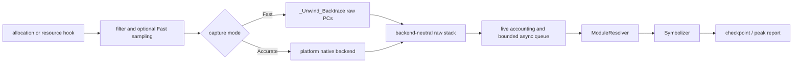

# liballoc_hook

`liballoc_hook.so` is a native allocation tracing library for Android,
OpenHarmony (OHOS), and glibc Linux. It interposes native allocation and
selected resource APIs, records live allocations and raw native PCs, and emits
checkpoint or peak reports.

[中文 README / Chinese README](README.zh-CN.md)

## General hook lifecycle

The interception path performs filtering, accounting decisions, and bounded
native capture only. Module lookup, worker-side `dladdr`, symbolization, and
report formatting stay outside the allocation hook. Successful `malloc`/`new`,
anonymous `mmap`, and selected resource-allocating `ioctl` events share one raw
stack contract; release paths reuse the stored allocation identity.

## Current architecture

The implementation is split into platform-neutral contracts and platform
backends:

- **Capture:** Fast uses bounded `_Unwind_Backtrace` capture when the compiler
  runtime exposes it. Accurate selects an explicit Android, Linux, or OHOS
  backend and preserves partial/error state.
- **Async resolution:** `AsyncStackPipeline` deduplicates raw stacks, snapshots
  loaded ELF modules, resolves dynamic names on a worker, and retains raw and
  module-relative PCs when symbols are unavailable.
- **Accounting:** `PointerData` owns live-allocation identity, sampled host
  accounting, resource accounting, and peak counters.
- **Platform boundaries:** CMake separates OS, libc, architecture, compiler
  unwind capability, and export policy. OHOS `mmap` interposition is opt-in.

See the detailed architecture contract in
[`docs/ARCHITECTURE.md`](docs/ARCHITECTURE.md). The architecture is native
C/C++ and current-thread oriented; managed-runtime stacks, remote-thread
contexts, and complete offline DWARF expansion are optional future capabilities.

## Usage

The same-language usage guide is the entry point for prerequisites, builds,
preload deployment, configuration, checkpoints, troubleshooting, and known
limitations:

[`docs/USAGE.md`](docs/USAGE.md)

The Chinese entry points remain entirely in Chinese:
[`README.zh-CN.md`](README.zh-CN.md),
[`docs/ARCHITECTURE.zh-CN.md`](docs/ARCHITECTURE.zh-CN.md), and
[`docs/USAGE.zh-CN.md`](docs/USAGE.zh-CN.md).

## Configuration

Everything is configured through the two tables below. There are no other
switches: if a behaviour is not listed here, it is not tunable.

### Build options (CMake)

| Option | Default | Effect |
| --- | --- | --- |
| `MALLOC_HOOK_ENABLE_DMA_CAPTURE` | `ON` | Capture DMA-BUF/ION/GPU buffers (`ioctl`/`close` interposition) in addition to `malloc`/`mmap`. Turn off only for host smoke builds with no driver UAPI; on a real device most pipeline memory is DMA, so leaving it off makes the report look empty. |
| `MALLOC_HOOK_OHOS_MMAP_HOOK` | `OFF` | Export `mmap`/`munmap` on OHOS. Off by default to limit loader/vendor interference. |
| `MALLOC_HOOK_BUILD_TESTS` | `ON` | Build the test binaries and register them with CTest. |
| `MALLOC_HOOK_BUILD_GL_TESTS` | `ON` on Android | Build the Android OpenGL integration fixture. |

`linux/dma-heap.h` is used from the sysroot when present; otherwise a vendored
copy of the UAPI is used, so a cross toolchain missing that header still gets
DMA capture. Nothing needs to be set for this.

### Runtime options (environment)

| Variable | Default | Effect |
| --- | --- | --- |
| `DUMP_PEAK_VALUE_MB` | unset | **Required to get a report.** Enables peak recording and the dump-on-exit report, and starts snapshotting once the tracked peak exceeds this many MB. Setting it also lowers the default minimum allocation size to 1 KB. |
| `ALLOC_HOOK_DUMP_PREFIX` | `/data/local/tmp/trace/backtrace_heap` | Path prefix for reports. Files are named `<prefix>.exit.pid_<pid>.time_<t>.txt`, so a report can always be tied to the process that produced it. |
| `DUMP_PEAK_STEP_MB` | `12` | Re-snapshot the peak every this many MB of growth. `0` snapshots on every new peak (much more expensive). |
| `BACKTRACE_MIN_SIZE` | `1024` when `DUMP_PEAK_VALUE_MB` is set, else `0` | Skip stack capture for allocations smaller than this. This is the main cost control: in a typical pipeline it filters >99% of allocations. |
| `ALLOC_HOOK_CAPTURE_MODE` | `fast` | `fast` = bounded raw-PC capture, no symbolization (resolve offline). `accurate` = OS-specific backend. |
| `ALLOC_HOOK_SAMPLING_INTERVAL_BYTES` | `1` (off) | Poisson-sample host allocations at this byte interval. Scales reported host sizes; does not affect DMA accounting. |
| `ALLOC_HOOK_FAST_CAPTURE_INTERVAL_BYTES` | `1` (off) | Capture a stack only once per this many bytes allocated. Suppresses stacks only; exact size accounting is unaffected. |
| `ALLOC_HOOK_FAST_UNWINDER` | unset | `compiler` forces `_Unwind_Backtrace` instead of the aarch64 frame-pointer walk. The frame-pointer walk is the default because it is cheaper and does not fault on targets whose unwind tables drive libgcc's pointer-authentication path into a `SIGILL`. |
| `BACKTRACE_DUMP_SIGNAL` | `SIGRTMIN+6` (Bionic: `BIONIC_SIGNAL_BACKTRACE`; OHOS: `46`) | Signal that triggers an on-demand report. |
| `ALLOC_HOOK_DEBUG` | unset | Set to anything to emit hook diagnostics (signal, unwind, and ION/DMA paths) on stderr. |

Naming note: the `DUMP_*` and `BACKTRACE_*` variables predate the
`ALLOC_HOOK_*` prefix and are kept as-is because deployment scripts depend on
them.

## Supported platforms

| Capability | Android | OHOS (default) | OHOS (`MALLOC_HOOK_OHOS_MMAP_HOOK=ON`) | glibc Linux |
| --- | --- | --- | --- | --- |
| `malloc`/`free`/`calloc`/`realloc` | Yes | Yes | Yes | Yes |
| aligned allocation APIs | Yes | Yes | Yes | Yes |
| `mmap`/`munmap` | Yes | No | Yes | Yes |
| `ioctl`/`close` DMA capture | Yes (default) | Yes (default) | Yes (default) | Yes (default) |
| checkpoint reports | Yes | Yes | Yes | Yes |

OHOS leaves `mmap` interposition disabled by default to reduce loader and vendor
runtime interference. Enable it only for a small, controlled reproduction.

## Scope and safety

This project traces native C/C++ allocation activity. Sampling changes host
allocation attribution, not resource accounting. Direct system calls and
unexported vendor entry points bypass interposition. Do not use generated
reports or private device identifiers as source documentation.
