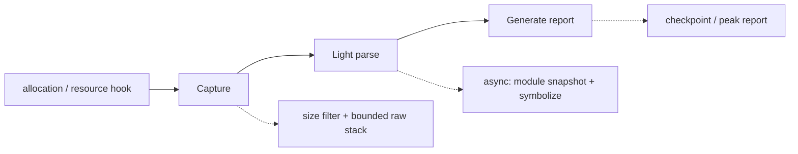

# liballoc_hook

`liballoc_hook.so` is a native allocation tracing library for Android,
OpenHarmony (OHOS), and glibc Linux. It interposes native allocation and
selected resource APIs, records live allocations and raw native PCs, and emits
checkpoint or peak reports.

[中文 README / Chinese README](README.zh-CN.md)

## Hook flow

The interception path does three things, in three stages, and only the first
runs on the allocating thread:



- **Capture** — on the allocating thread. Filter by size, then take a bounded
  raw-PC stack (a frame-pointer walk in Fast mode, an OS backend in Accurate
  mode). No module lookup, no symbolization, no dynamic allocation.
- **Light parse** — on a worker thread. Deduplicate raw stacks, snapshot the
  loaded ELF modules, and resolve dynamic symbol names, keeping raw and
  module-relative PCs when symbols are unavailable.
- **Generate report** — a checkpoint (on demand) or a peak report (on exit).

Successful `malloc`/`new`, anonymous `mmap`, and selected resource-allocating
`ioctl` events share one raw-stack contract; release paths reuse the stored
allocation identity.

## Architecture

The implementation is split into platform-neutral contracts and platform
backends. The three flow stages map onto these pieces:

- **Capture.** `CaptureStack()` returns a project-owned `RawStackRecord` with
  capture state, mode, backend, terminal error, skipped-frame count, module
  generation, and bounded PCs. Fast uses a bounded frame-pointer walk on aarch64
  (falling back to `_Unwind_Backtrace` where the frame-pointer walk is
  unavailable); Accurate selects an explicit Android, Linux, or OHOS backend and
  preserves partial/error state. The core contract is native C/C++ and
  current-thread; managed-runtime stacks, other-thread contexts, and offline
  DWARF expansion are optional future capabilities.
- **Light parse.** `AsyncStackPipeline` deduplicates records by raw PCs and
  module generation, snapshots loaded ELF load segments through `dl_iterate_phdr`
  on a worker, and uses worker-side `dladdr` for dynamic symbol names. It always
  retains raw and module-relative PCs, and does not promise complete DWARF or
  offline symbolization. Queue capacity, duplicate suppression, dropped work, and
  processed results are exposed through `AsyncStackStats`; hook boundaries use
  `AsyncStackWorkerThread()` so the resolver's own allocations are not tracked.
- **Report addresses.** Captured PCs are return addresses, so every
  module-relative PC in a report is stepped back into the call instruction before
  module lookup. The addresses on `#<n> <addr> <module>` lines are ELF virtual
  addresses of call sites and can be fed straight to
  `llvm-symbolizer --obj=<unstripped-elf>`; each report states the convention on
  its `frame_pc:` line.
- **Accounting.** `PointerData` owns the live-allocation table, resource
  accounting, and peak counters. Every eligible allocation is tracked at its
  exact size; the size filter (`BACKTRACE_MIN_SIZE`) is the only cost control.
- **Platform boundaries.** CMake separates OS, libc, architecture, compiler
  unwind capability, and export policy. mmap interposition is a single capability
  gated by `ENABLE_MMAP_HOOK_EXPORT`, on by default on Android and glibc Linux
  and off by default on OHOS to limit loader/vendor interference. Resource hooks
  are exported only when DMA capture is built in.

## Documentation

| Document | What it covers |
| --- | --- |
| [`docs/get_hook_report.md`](docs/get_hook_report.md) | The two kinds of hook behaviour — the observe-only probe and the two report modes — and how to read a report. |
| [`docs/EXAMPLE.md`](docs/EXAMPLE.md) | Prerequisites, builds, preload deployment, checkpoints, troubleshooting, and known limitations, end to end. |
| [`docs/GPU_MEMORY_ACCOUNTING.md`](docs/GPU_MEMORY_ACCOUNTING.md) | How GPU device memory is accounted, which driver paths land in which signal, and the vendor API pitfalls. |

Chinese entry points:
[`README.zh-CN.md`](README.zh-CN.md),
[`docs/get_hook_report.zh-CN.md`](docs/get_hook_report.zh-CN.md),
[`docs/EXAMPLE.zh-CN.md`](docs/EXAMPLE.zh-CN.md), and
[`docs/GPU_MEMORY_ACCOUNTING.zh-CN.md`](docs/GPU_MEMORY_ACCOUNTING.zh-CN.md).

## Configuration

Everything is configured through the two tables below. There are no other
switches: if a behaviour is not listed here, it is not tunable.

### Build options (CMake)

| Option | Default | Effect |
| --- | --- | --- |
| `MALLOC_HOOK_ENABLE_DMA_CAPTURE` | `ON` | Capture DMA-BUF/ION/GPU buffers (`ioctl`/`close` interposition) in addition to `malloc`/`mmap`. Turn off only for host smoke builds with no driver UAPI; on a real device most pipeline memory is DMA, so leaving it off makes the report look empty. This governs only the tracked interposition — the observed-memory sampler reads dmabuf from `/proc` regardless. |
| `ENABLE_MMAP_HOOK_EXPORT` | `ON` (Android/Linux), `OFF` (OHOS) | Export `mmap`/`munmap`/`mremap` hooks. A single platform-neutral switch; OHOS defaults it off to limit loader/vendor interference. When off, the mmap family is stripped from the version script so the linker never exports an uncompiled hook. |
| `MALLOC_HOOK_BUILD_TESTS` | `ON` | Build the test binaries and register them with CTest. |
| `MALLOC_HOOK_BUILD_GL_TESTS` | `ON` on Android | Build the Android OpenGL integration fixture. |

`linux/dma-heap.h` is used from the sysroot when present; otherwise a vendored
copy of the UAPI is used, so a cross toolchain missing that header still gets
DMA capture. Nothing needs to be set for this.

`build_android.sh`, `build_linux.sh`, and `build_ohos.sh` print the effective
options and derived export policy after a successful build. For a manual CMake
build, run `cmake --build <build-dir> --target print_build_options`.

### Runtime options (environment)

| Variable | Default | Effect |
| --- | --- | --- |
| `DUMP_PEAK_VALUE_MB` | unset | A positive floor selects **first-crossing** mode: enables peak recording and dump on exit, and retains a single snapshot, taken the first time the peak criterion passes this many MB. `0` turns first-crossing off. |
| `DUMP_PEAK_STEP_MB` | `0` (off) | A positive step together with `ALLOC_HOOK_PEAK_SAMPLE_MS` selects **peak-chasing**; on its own it does nothing. Upper bound on the growth required before the peak snapshot is rebuilt; for small peaks the code uses 25% growth with a 64 KB floor. Unused in first-crossing mode. |
| `ALLOC_HOOK_PEAK_SAMPLE_MS` | the interval published by a host framework, else `50` when peak recording is on | Interval for sampling the process's *observed* footprint (`VmRSS` + dmabuf + uncovered GPU mappings) on a dedicated thread. **On its own it selects the observe-only probe**: the footprint is measured and logged, nothing is tracked. `0` forces the sampler off. |
| `ALLOC_HOOK_DUMP_PREFIX` | `/data/local/tmp/trace/backtrace_heap` | Path prefix for reports. Files are named `<prefix>.exit.pid_<pid>.time_<t>.txt`. |
| `BACKTRACE_MIN_SIZE` | OHOS: `40960`; elsewhere `1024` when peak recording is on, else `0` | Skip stack capture for allocations smaller than this. The main cost control: in a typical pipeline it filters >99% of allocations. |
| `ALLOC_HOOK_CAPTURE_MODE` | `fast` | `fast` = bounded raw-PC capture with no symbolization on the allocation thread; the worker may resolve dynamic symbols. `accurate` = OS-specific backend. |
| `ENABLE_HOOK_DEBUG` | unset | Set to anything to emit hook diagnostics (signal, unwind, and ION/DMA paths) on stderr. |
| `MALLOC_HOOK_TRACE_ALLOC` | unset | Emit Perfetto atrace markers (one switch, both streams): a begin/end async slice per tracked allocation (`memory_<type>@<ptr>.h<hash>`, the end = its release time) and a `malloc_hook_peak_snapshot` slice + MiB counters at each peak snapshot. Needs a writable `/sys/kernel/tracing/trace_marker` (root / SELinux permissive) and a Perfetto config recording `ftrace/print`; no-op otherwise. Consumed offline by `scripts/build_perfetto_alloc_track.py`. |

The report-trigger signal is not tunable: each platform uses its conventional
backtrace signal (Bionic's reserved backtrace signal on Android, `46` on OHOS,
`SIGRTMIN+6` elsewhere).

Naming note: the `DUMP_*` and `BACKTRACE_*` variables predate the `ALLOC_HOOK_*`
prefix and are kept as-is because deployment scripts depend on them.

## Getting a report

Which mode a run is in is decided entirely by which variables above are set:

- Set nothing (bare `LD_PRELOAD`) for the **lightweight tracked probe** — tracks
  allocations but captures no stacks, and prints the tracked host / dma / total
  peak at exit. Cheap enough for a quick "how much does the hook see" pass, and
  the natural way to pick a `DUMP_PEAK_VALUE_MB` floor.
- Set only `ALLOC_HOOK_PEAK_SAMPLE_MS` for the **observe-only probe** — measures
  how much the process holds (rss / dma / gpu from `/proc`), tracks nothing, and
  prints a log block at exit.
- Set `DUMP_PEAK_VALUE_MB` (with `ALLOC_HOOK_PEAK_SAMPLE_MS=0` to judge against
  the tracked total) for **first crossing** — one report, one stack walk,
  answering what held memory when it first passed the floor. This is the common
  report mode.
- Set `ALLOC_HOOK_PEAK_SAMPLE_MS` + `DUMP_PEAK_STEP_MB` for **peak chasing** —
  one report describing the run's maximum, with a stack walk per step of growth.

Full command lines, output, and how to read every report field are in
[`docs/get_hook_report.md`](docs/get_hook_report.md).

## Perfetto timeline & offline tooling

With `MALLOC_HOOK_TRACE_ALLOC=1`, a run that is also captured by Perfetto (with
`ftrace/print`) gets a clean **"Memory Top Allocations"** track: one begin→free slice
per tracked allocation (the free is its release time) plus a **`[memory hook] Peak`**
sub-track marking each peak snapshot in MiB. The `scripts/` build it offline:

```
# 1) symbolize the dump -> report + hash map (auto-loads maps.json; -m limits the top-N)
python3 scripts/process_memory_stack.py -f <backtrace_heap*.txt> -m 30 -r report.md --export-hash-map
# 2) memory-use counters (clip the CSV to the trace's time window first)
python3 scripts/merge_csv_to_perfetto.py --trace <trace.perfetto> --csv <mem_use.csv> --output overlay.perfetto
# 3) allocation lifetimes + peak (reads <hook_root>/hash_index_map.json by default)
python3 scripts/build_perfetto_alloc_track.py --trace overlay.perfetto --output final.perfetto
```

`process_memory_stack.py` reads project-specific symbolization config (source roots,
excluded/forwarding frames, pipeline naming) from a gitignored `<hook_root>/maps.json`
(schema: `scripts/maps.example.json`; `$MALLOC_HOOK_MAPS` overrides). Missing file →
generic defaults.

**Climb mode** (`ALLOC_HOOK_PEAK_SAMPLE_MS` + `DUMP_PEAK_STEP_MB`, peak-chasing) writes
one report per step of growth as `<prefix>.step.<MB>MB.txt`, named by that rung's peak
size — feed each to step 1 for a report per rung. **Peak mode** (`DUMP_PEAK_VALUE_MB`,
first-crossing) produces a single peak report.

## Packaging (cpack)

The `VERSION` file is the source of truth (tag as `v<VERSION>`). After a platform build,
`(cd <build> && cpack)` produces `malloc_hook-<version>-<abi>.tar.gz` laid out as
`lib/liballoc_hook.so` + `scripts/*.py` + `scripts/maps.example.json` + `README.md` +
`VERSION`. The `dist` component is `EXCLUDE_FROM_ALL`, so the platform `build_*.sh`
scripts' own `ninja install` is unaffected.

## Supported platforms

| Capability | Android | OHOS (default) | OHOS (`ENABLE_MMAP_HOOK_EXPORT=ON`) | glibc Linux |
| --- | --- | --- | --- | --- |
| `malloc`/`free`/`calloc`/`realloc` | Yes | Yes | Yes | Yes |
| aligned allocation APIs | Yes | Yes | Yes | Yes |
| `mmap`/`munmap` | Yes | No | Yes | Yes |
| `ioctl`/`close` DMA capture | Yes (default) | Yes (default) | Yes (default) | Yes (default) |
| checkpoint reports | Yes | Yes | Yes | Yes |

`ENABLE_MMAP_HOOK_EXPORT` defaults off on OHOS to reduce loader and vendor
runtime interference. Enable it only for a small, controlled reproduction.

## Scope and safety

This project traces native C/C++ allocation activity. Direct system calls and
unexported vendor entry points bypass interposition. Do not use generated
reports or private device identifiers as source documentation.
