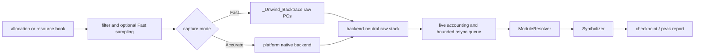

# liballoc_hook

`liballoc_hook.so` is a native allocation tracing library for Android,
OpenHarmony (OHOS), and glibc Linux. It interposes native allocation and
selected resource APIs, records live allocations and raw native PCs, and emits
checkpoint or peak reports.

[中文 README / Chinese README](README.zh-CN.md)

## General hook lifecycle

The interception path performs filtering, accounting decisions, and bounded
native capture only. Module lookup, worker-side `dladdr`, symbolization, and
report formatting stay outside the allocation hook. Successful `malloc`/`new`,
anonymous `mmap`, and selected resource-allocating `ioctl` events share one raw
stack contract; release paths reuse the stored allocation identity.

## Current architecture

The implementation is split into platform-neutral contracts and platform
backends:

- **Capture:** Fast uses bounded `_Unwind_Backtrace` capture when the compiler
  runtime exposes it. Accurate selects an explicit Android, Linux, or OHOS
  backend and preserves partial/error state.
- **Async resolution:** `AsyncStackPipeline` deduplicates raw stacks, snapshots
  loaded ELF modules, resolves dynamic names on a worker, and retains raw and
  module-relative PCs when symbols are unavailable.
- **Accounting:** `PointerData` owns live-allocation identity, sampled host
  accounting, resource accounting, and peak counters.
- **Platform boundaries:** CMake separates OS, libc, architecture, compiler
  unwind capability, and export policy. OHOS `mmap` interposition is opt-in.

See the detailed architecture contract in
[`docs/ARCHITECTURE.md`](docs/ARCHITECTURE.md). The architecture is native
C/C++ and current-thread oriented; managed-runtime stacks, remote-thread
contexts, and complete offline DWARF expansion are optional future capabilities.

## Usage

The same-language usage guide is the entry point for prerequisites, builds,
preload deployment, configuration, checkpoints, troubleshooting, and known
limitations:

[`docs/USAGE.md`](docs/USAGE.md)

The Chinese entry points remain entirely in Chinese:
[`README.zh-CN.md`](README.zh-CN.md),
[`docs/ARCHITECTURE.zh-CN.md`](docs/ARCHITECTURE.zh-CN.md), and
[`docs/USAGE.zh-CN.md`](docs/USAGE.zh-CN.md).

## Supported platforms

| Capability | Android | OHOS (default) | OHOS (`OHOS_ENABLE_MMAP_HOOK=ON`) | glibc Linux |
| --- | --- | --- | --- | --- |
| `malloc`/`free`/`calloc`/`realloc` | Yes | Yes | Yes | Yes |
| aligned allocation APIs | Yes | Yes | Yes | Yes |
| `mmap`/`munmap` | Yes | No | Yes | Yes |
| `ioctl`/`close` resource hooks | Optional build feature | Optional build feature | Optional build feature | Optional build feature |
| checkpoint reports | Yes | Yes | Yes | Yes |

OHOS leaves `mmap` interposition disabled by default to reduce loader and vendor
runtime interference. Enable it only for a small, controlled reproduction.

## Scope and safety

This project traces native C/C++ allocation activity. Sampling changes host
allocation attribution, not resource accounting. Direct system calls and
unexported vendor entry points bypass interposition. Do not use generated
reports or private device identifiers as source documentation.
