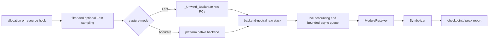

# liballoc_hook

`liballoc_hook.so` is a native allocation tracing library for Android,
OpenHarmony (OHOS), and glibc Linux. It interposes native allocation and
selected resource APIs, records live allocations and raw native PCs, and emits
checkpoint or peak reports.

[中文 README / Chinese README](README.zh-CN.md)

## General hook lifecycle



The interception path performs filtering, accounting decisions, and bounded
native capture only. Module lookup, worker-side `dladdr`, symbolization, and
report formatting stay outside the allocation hook. Successful `malloc`/`new`,
anonymous `mmap`, and selected resource-allocating `ioctl` events share one raw
stack contract; release paths reuse the stored allocation identity.

## Current architecture

The implementation is split into platform-neutral contracts and platform
backends:

- **Capture:** Fast uses bounded `_Unwind_Backtrace` capture when the compiler
  runtime exposes it. Accurate selects an explicit Android, Linux, or OHOS
  backend and preserves partial/error state.
- **Async resolution:** `AsyncStackPipeline` deduplicates raw stacks, snapshots
  loaded ELF modules, resolves dynamic names on a worker, and retains raw and
  module-relative PCs when symbols are unavailable.
- **Accounting:** `PointerData` owns live-allocation identity, sampled host
  accounting, resource accounting, and peak counters.
- **Platform boundaries:** CMake separates OS, libc, architecture, compiler
  unwind capability, and export policy. OHOS `mmap` interposition is opt-in.

See the detailed architecture contract in
[`docs/ARCHITECTURE.md`](docs/ARCHITECTURE.md). The architecture is native
C/C++ and current-thread oriented; managed-runtime stacks, remote-thread
contexts, and complete offline DWARF expansion are optional future capabilities.

## Usage

The same-language usage guide is the entry point for prerequisites, builds,
preload deployment, configuration, checkpoints, troubleshooting, and known
limitations:

[`docs/USAGE.md`](docs/USAGE.md)

The Chinese entry points remain entirely in Chinese:
[`README.zh-CN.md`](README.zh-CN.md),
[`docs/ARCHITECTURE.zh-CN.md`](docs/ARCHITECTURE.zh-CN.md), and
[`docs/USAGE.zh-CN.md`](docs/USAGE.zh-CN.md).

## Configuration

Everything is configured through the two tables below. There are no other
switches: if a behaviour is not listed here, it is not tunable.

### Build options (CMake)

| Option | Default | Effect |
| --- | --- | --- |
| `MALLOC_HOOK_ENABLE_DMA_CAPTURE` | `ON` | Capture DMA-BUF/ION/GPU buffers (`ioctl`/`close` interposition) in addition to `malloc`/`mmap`. Turn off only for host smoke builds with no driver UAPI; on a real device most pipeline memory is DMA, so leaving it off makes the report look empty. |
| `MALLOC_HOOK_OHOS_MMAP_HOOK` | `OFF` | Export `mmap`/`munmap` on OHOS. Off by default to limit loader/vendor interference. |
| `MALLOC_HOOK_BUILD_TESTS` | `ON` | Build the test binaries and register them with CTest. |
| `MALLOC_HOOK_BUILD_GL_TESTS` | `ON` on Android | Build the Android OpenGL integration fixture. |

`linux/dma-heap.h` is used from the sysroot when present; otherwise a vendored
copy of the UAPI is used, so a cross toolchain missing that header still gets
DMA capture. Nothing needs to be set for this.

### Runtime options (environment)

| Variable | Default | Effect |
| --- | --- | --- |
| `DUMP_PEAK_VALUE_MB` | unset | **Required to get a report.** Enables peak recording and the dump-on-exit report, and starts snapshotting once the tracked peak exceeds this many MB. Setting it also lowers the default minimum allocation size to 1 KB. |
| `ALLOC_HOOK_DUMP_PREFIX` | `/data/local/tmp/trace/backtrace_heap` | Path prefix for reports. Files are named `<prefix>.exit.pid_<pid>.time_<t>.txt`, so a report can always be tied to the process that produced it. |
| `DUMP_PEAK_STEP_MB` | `12` | Re-snapshot the peak every this many MB of growth. `0` snapshots on every new peak (much more expensive). Applies to whichever peak criterion is in use. |
| `ALLOC_HOOK_PEAK_SAMPLE_MS` | the interval published by a host framework, else off | Interval at which the process's *observed* footprint — `VmRSS` from `/proc/self/status`, its dmabuf bytes, and GPU device mappings that neither of those covers — is sampled on a dedicated thread, and the peak snapshot is taken at the maximum of their sum instead of at the maximum of tracked allocation bytes. Those maxima are different instants: on one measured run the resident peak led the device-buffer peak by 167 ms. Use this whenever the number you are optimising against comes from an external sampler, so the stacks describe the moment that sampler calls the peak. `0` forces it off. |
| `BACKTRACE_MIN_SIZE` | `1024` when `DUMP_PEAK_VALUE_MB` is set, else `0` | Skip stack capture for allocations smaller than this. This is the main cost control: in a typical pipeline it filters >99% of allocations. |
| `ALLOC_HOOK_CAPTURE_MODE` | `fast` | `fast` = bounded raw-PC capture, no symbolization (resolve offline). `accurate` = OS-specific backend. |
| `ALLOC_HOOK_SAMPLING_INTERVAL_BYTES` | `1` (off) | Poisson-sample host allocations at this byte interval. Scales reported host sizes; does not affect DMA accounting. |
| `ALLOC_HOOK_FAST_CAPTURE_INTERVAL_BYTES` | `1` (off) | Capture a stack only once per this many bytes allocated. Suppresses stacks only; exact size accounting is unaffected. |
| `ALLOC_HOOK_FAST_UNWINDER` | unset | `compiler` forces `_Unwind_Backtrace` instead of the aarch64 frame-pointer walk. The frame-pointer walk is the default because it is cheaper and does not fault on targets whose unwind tables drive libgcc's pointer-authentication path into a `SIGILL`. |
| `BACKTRACE_DUMP_SIGNAL` | `SIGRTMIN+6` (Bionic: `BIONIC_SIGNAL_BACKTRACE`; OHOS: `46`) | Signal that triggers an on-demand report. |
| `ALLOC_HOOK_DEBUG` | unset | Set to anything to emit hook diagnostics (signal, unwind, and ION/DMA paths) on stderr. |

Naming note: the `DUMP_*` and `BACKTRACE_*` variables predate the
`ALLOC_HOOK_*` prefix and are kept as-is because deployment scripts depend on
them.

### Aligning the snapshot with an external sampler

`ALLOC_HOOK_PEAK_SAMPLE_MS` needs no value in the common case. A host framework
that samples this process's memory publishes the interval it uses in a variable
whose name ends in `AUTO_SHOW_MEM_USE_DURATION_MS`; when the hook finds one set
to a positive value it adopts that interval, so both sides sample the same
quantity at the same cadence with nothing to keep in sync by hand. Setting
`ALLOC_HOOK_PEAK_SAMPLE_MS` explicitly overrides that, including to `0`.

The report says which criterion produced the snapshot it retained, and — when it
was the observed footprint — what that footprint read at the snapshot instant,
what its maximum over the run was, and what the sampler cost:

```text
peak_criterion: observed_host_rss_plus_dma_plus_gpu (from /proc, aligned with an external sampler)
observed_peak(at_snapshot):     rss=291.75MB dma=935.12MB gpu=24.00MB total=1250.87MB
observed_peak(max_of_sum):      rss=291.75MB dma=935.12MB gpu=24.00MB total=1250.87MB (...)
observed_peak(independent_max): rss=369.54MB dma=935.12MB gpu=24.00MB
observed_sampler: interval_ms=1 achieved_ms=1.58 dma_source=fd+maps gpu_source=smaps samples=9516 ...
```

`at_snapshot` equal to `max_of_sum` is the goal state: the stacks were captured
at the maximum, not at some earlier step of it. `achieved_ms` above the
requested interval means the `/proc` reads cost more than the interval and the
sampler throttled itself to stay under half a core — it never silently claims a
cadence it did not reach. `independent_max` is higher than any single part of
`max_of_sum` whenever host and device memory peak at different moments, which is
the situation this whole mechanism exists for.

`gpu` is device memory a driver mmap'd from a character device instead of handing
out a dmabuf, and mapped PFN/IO rather than with struct pages behind it. Such a
region escapes `rss` and `dma` simultaneously — it is not a dmabuf, and the
kernel excludes PFN/IO pages from `VmRSS` because there is no page to account —
so before it was added the sum here was short by exactly that amount against an
external sampler reporting the same three parts. It is read from
`/proc/self/smaps` as per-region `Size - Rss`, so a region the kernel *does*
count in `VmRSS` contributes only the part `rss` does not already hold.

Three things this cannot do. The sampler reads `/proc`, so it sees the process at
sample instants only; a peak that exists for less than one interval is missed by
it exactly as it is missed by the external sampler being aligned with.
`dma_source=none` means this kernel exposes no reachable dmabuf accounting, which
is not the same as the process holding no device memory. And `gpu_source` is
`not_applicable` on any platform without the device node this pass counts, which
is likewise not a measurement of zero: it is the reason no measurement was
attempted. That check happens before `/proc/self/smaps` is opened, deliberately —
the kernel walks every PTE of every VMA to produce the per-region residency this
pass reads, ~25 ms for a ~460 MB process on a measured arm64 target, so filtering
regions out *after* the read would pay the whole cost to return zero.

## Supported platforms

| Capability | Android | OHOS (default) | OHOS (`MALLOC_HOOK_OHOS_MMAP_HOOK=ON`) | glibc Linux |
| --- | --- | --- | --- | --- |
| `malloc`/`free`/`calloc`/`realloc` | Yes | Yes | Yes | Yes |
| aligned allocation APIs | Yes | Yes | Yes | Yes |
| `mmap`/`munmap` | Yes | No | Yes | Yes |
| `ioctl`/`close` DMA capture | Yes (default) | Yes (default) | Yes (default) | Yes (default) |
| checkpoint reports | Yes | Yes | Yes | Yes |

OHOS leaves `mmap` interposition disabled by default to reduce loader and vendor
runtime interference. Enable it only for a small, controlled reproduction.

## Scope and safety

This project traces native C/C++ allocation activity. Sampling changes host
allocation attribution, not resource accounting. Direct system calls and
unexported vendor entry points bypass interposition. Do not use generated
reports or private device identifiers as source documentation.
