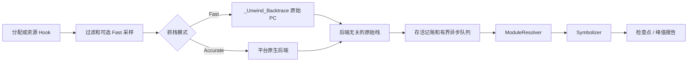

# liballoc_hook

`liballoc_hook.so` 是面向 Android、OpenHarmony（OHOS）和 glibc Linux 的原生
内存分配追踪库。它拦截原生分配及选定资源 API，记录存活分配和原始 native
PC，并生成检查点或峰值报告。

[English README / 英文 README](README.md)

## 通用 Hook 生命周期



拦截热路径只执行过滤、记账决策和有界 native 抓栈。模块查找、worker
线程中的 `dladdr`、符号化和报告格式化都在分配 Hook 之外执行。成功的
`malloc`/`new`、匿名 `mmap` 和选定资源分配 `ioctl` 事件共享统一原始栈契约；
释放路径复用已有的分配身份。

## 当前架构

实现由平台无关契约和平台后端组成：

- **Capture：** 当编译器运行时提供能力时，Fast 使用有界
  `_Unwind_Backtrace`。Accurate 选择明确的 Android、Linux 或 OHOS 后端，
  并保留部分栈及错误状态。
- **异步解析：** `AsyncStackPipeline` 对原始栈去重，在 worker 中快照已加载
  ELF 模块并解析动态符号；符号不可用时仍保留原始 PC 和模块相对 PC。
- **记账：** `PointerData` 管理存活分配身份、host 采样记账、资源记账和峰值
  计数器。
- **平台边界：** CMake 分离 OS、libc、架构、编译器 unwind 能力和导出策略。
  OHOS 的 `mmap` 拦截默认关闭。

详细架构契约见
[`docs/ARCHITECTURE.zh-CN.md`](docs/ARCHITECTURE.zh-CN.md)。核心范围是原生
C/C++ 和当前线程；托管运行时栈、远程线程上下文和完整离线 DWARF 展开属于
未来的可选能力。

## 使用说明

同语言使用说明是构建前提、构建、预加载部署、配置、检查点、故障排查和已知
限制的统一入口：

[`docs/USAGE.zh-CN.md`](docs/USAGE.zh-CN.md)

英文入口仍为 [`README.md`](README.md)、[`docs/ARCHITECTURE.md`](docs/ARCHITECTURE.md)
和 [`docs/USAGE.md`](docs/USAGE.md)。

## 配置项

所有配置都在下面两张表里。除此之外没有其他开关：没有列在这里的行为就是不可
调的。

### 构建选项（CMake）

| 选项 | 默认值 | 作用 |
| --- | --- | --- |
| `MALLOC_HOOK_ENABLE_DMA_CAPTURE` | `ON` | 在 `malloc`/`mmap` 之外同时抓取 DMA-BUF/ION/GPU buffer（拦截 `ioctl`/`close`）。只有在没有任何驱动 UAPI 的宿主 smoke 构建里才关闭；真机上流水线的大部分内存都是 DMA，关掉会让报告看起来几乎是空的。 |
| `MALLOC_HOOK_OHOS_MMAP_HOOK` | `OFF` | 在 OHOS 上导出 `mmap`/`munmap`。默认关闭以减少 loader 和厂商运行时受到的影响。 |
| `MALLOC_HOOK_BUILD_TESTS` | `ON` | 构建测试程序并注册到 CTest。 |
| `MALLOC_HOOK_BUILD_GL_TESTS` | Android 上为 `ON` | 构建 Android OpenGL 集成测试。 |

`linux/dma-heap.h` 优先使用 sysroot 中的版本；没有时使用仓库内自带的一份
UAPI，因此缺少该头文件的交叉工具链依然可以抓取 DMA。这一步不需要任何配置。

`build_android.sh`、`build_linux.sh` 和 `build_ohos.sh` 会在成功编译后打印实际
生效的选项和派生出的导出策略。手工使用 CMake 构建时，可运行
`cmake --build <build-dir> --target print_build_options` 查看同一份摘要。

### 运行选项（环境变量）

| 变量 | 默认值 | 作用 |
| --- | --- | --- |
| `DUMP_PEAK_VALUE_MB` | 未设置 | **正常退出时自动生成峰值报告必须设置它。** 打开峰值记录和退出时导出，并在当前所选峰值判据超过该 MB 数后开始抓取快照；不设置时仍可按需生成检查点报告。设置它同时会把默认最小分配尺寸降到 1 KB。 |
| `ALLOC_HOOK_DUMP_PREFIX` | `/data/local/tmp/trace/backtrace_heap` | 报告路径前缀。文件名为 `<prefix>.exit.pid_<pid>.time_<t>.txt`，因此报告始终能对应到产生它的进程。 |
| `DUMP_PEAK_STEP_MB` | `12` | 重新构建峰值快照所需增长量的上限。峰值较小时实际使用 25% 的增长量，下限为 64 KB；`0` 表示每次新峰值都抓（开销大得多）。对两种峰值判据都生效。 |
| `ALLOC_HOOK_PEAK_SAMPLE_MS` | 宿主框架公布的采样间隔，否则关闭 | 正整数表示在独立线程上采样进程的**实测**占用：`/proc/self/status` 的当前 `VmRSS`、dmabuf 字节数，以及这两者都覆盖不到的 GPU 设备映射。以同一轮采样中三者之和作为峰值判据，而不是使用跟踪到的分配字节数。只有 `DUMP_PEAK_VALUE_MB` 已启用峰值记录时才生效；`0` 表示强制关闭。 |
| `BACKTRACE_MIN_SIZE` | 设置了 `DUMP_PEAK_VALUE_MB` 时为 `1024`，否则为 `0` | 小于该尺寸的分配不抓堆栈。这是最主要的开销控制项：典型流水线里它会过滤掉 99% 以上的分配。 |
| `ALLOC_HOOK_CAPTURE_MODE` | `fast` | `fast` = 在分配线程中只抓有界原始 PC，不做符号化；worker 后续可解析动态符号。`accurate` = 使用操作系统特定后端。 |
| `ALLOC_HOOK_SAMPLING_INTERVAL_BYTES` | `1`（关闭） | 按该字节间隔对 host 分配做 Poisson 采样。会缩放报告中的 host 尺寸，不影响 DMA 统计。 |
| `ALLOC_HOOK_FAST_CAPTURE_INTERVAL_BYTES` | `1`（关闭） | 每分配这么多字节才抓一次堆栈。只抑制堆栈，不影响精确的尺寸统计。 |
| `ALLOC_HOOK_FAST_UNWINDER` | 未设置 | 设为 `compiler` 时强制使用 `_Unwind_Backtrace`，而不是 aarch64 帧指针回溯。默认使用帧指针回溯，因为它更快，而且不会在某些 unwind 表会把 libgcc 带进指针认证路径、进而触发 `SIGILL` 的目标上崩溃。 |
| `BACKTRACE_DUMP_SIGNAL` | `SIGRTMIN+6`（Bionic 为 `BIONIC_SIGNAL_BACKTRACE`；OHOS 为 `46`） | 触发按需导出报告的信号。 |
| `ALLOC_HOOK_DEBUG` | 未设置 | 设为任意值即在 stderr 输出 hook 诊断信息（信号、unwind、ION/DMA 路径）。 |

命名说明：`DUMP_*` 和 `BACKTRACE_*` 这些变量早于 `ALLOC_HOOK_*` 前缀，因为部署
脚本依赖它们，所以保持原样。

### 让快照时刻和外部采样器对齐

常见场景下 `ALLOC_HOOK_PEAK_SAMPLE_MS` 不需要显式赋值。采样本进程内存的宿主框架
会把自己使用的间隔写在一个名字以 `AUTO_SHOW_MEM_USE_DURATION_MS` 结尾的环境变量
里；hook 发现它被设为正值时就直接沿用该间隔，因此不需要人工同步采样节奏。显式
设置 `ALLOC_HOOK_PEAK_SAMPLE_MS` 会覆盖它，包括设为 `0`。如果没有同时设置
`DUMP_PEAK_VALUE_MB`，该变量不会启动采样线程。

这里不会读取历史累计字段 `VmPeak` 或 `VmHWM`，因为它们无法告诉 hook 应在哪一刻
复制存活堆栈。每一轮采样先读取当前 `VmRSS`，再读取 DMA 和 GPU 内存，并用同一轮
三者之和与此前最大值比较。当总和还越过 `DUMP_PEAK_VALUE_MB` 和
`DUMP_PEAK_STEP_MB` 的门槛时，回调会立即再次读取
`VmRSS`/`RssAnon`/`RssFile`/`RssShmem`，从 `/proc/self/smaps` 收集驻留量最高的
映射，并复制存活堆栈表。这些读取和堆栈复制是顺序执行的，不是内核提供的原子快照；
报告中的 `at_peak` 表示它们来自同一个峰值回调窗口。

如果要求每次出现新的实测最大值都保留对应快照，可以显式配置：

```sh
export DUMP_PEAK_VALUE_MB=0          # 立即启用；也可设下限以跳过启动阶段
export ALLOC_HOOK_PEAK_SAMPLE_MS=5   # 最好与外部采样器保持一致
export DUMP_PEAK_STEP_MB=0           # 对齐采样到的最终最大值，但快照开销更高
export BACKTRACE_MIN_SIZE=1024       # 只有确实需要每个小分配的栈时才设为 0
```

需要精确 host 归因并为每个满足尺寸条件的分配抓栈时，应让
`ALLOC_HOOK_SAMPLING_INTERVAL_BYTES` 和 `ALLOC_HOOK_FAST_CAPTURE_INTERVAL_BYTES`
保持未设置（实际默认值均为 `1`）。在存在受支持 GPU 设备节点的平台上，实测判据是
`rss + dma + gpu`；当前没有只排除这项未被其他统计覆盖的 GPU 内存、强制改为
`rss + dma` 的运行时开关。

报告会写明保留下来的快照是哪种判据产生的；如果是实测占用，还会写明快照那一刻的实
测值、整个 run 的最大值，以及采样器本身的开销：

```text
peak_criterion: observed_host_rss_plus_dma_plus_gpu (from /proc, aligned with an external sampler)
observed_peak(at_snapshot):     rss=291.75MB dma=935.12MB gpu=24.00MB total=1250.87MB
observed_peak(max_of_sum):      rss=291.75MB dma=935.12MB gpu=24.00MB total=1250.87MB (...)
observed_peak(independent_max): rss=369.54MB dma=935.12MB gpu=24.00MB
observed_sampler: interval_ms=1 achieved_ms=1.58 dma_source=fd+maps gpu_source=smaps samples=9516 ...
```

`at_snapshot` 和 `max_of_sum` 相等就是目标状态：堆栈是在最大值那一刻抓的，而不是在
爬升过程中的某一级。`achieved_ms` 大于请求的间隔说明读 `/proc` 的耗时超过了间隔，
采样器自行降频以保证不超过半个核——它不会谎报一个没达到的节奏。当 host 和设备内存
在不同时刻见顶时，`independent_max` 会高于 `max_of_sum` 中的任一项，而这正是这套机
制存在的理由。

`gpu` 指驱动没有走 dmabuf、而是直接 mmap 字符设备拿到的设备内存，并且是 PFN/IO 映射、
背后没有 struct page。这类区间会同时躲开 `rss` 和 `dma`：它不是 dmabuf，而内核又因为
没有 page 可计账而把 PFN/IO 页排除在 `VmRSS` 之外——所以在补上这一项之前，这里的和相
对于同样上报这三项的外部采样器，正好少了这么多。它按每个区间的 `Size - Rss` 从
`/proc/self/smaps` 读出，因此内核**确实**计入 `VmRSS` 的那部分只贡献 `rss` 还没算上的
差额。

三件它做不到的事：采样器读的是 `/proc`，只能看到采样时刻的进程状态，持续时间不足
一个间隔的峰值它抓不到——被对齐的那个外部采样器同样抓不到。`dma_source=none` 表示
这个内核没有可读取的 dmabuf 统计接口，不等于进程没有占用设备内存。而在没有这一遍
所统计的设备节点的平台上 `gpu_source` 为 `not_applicable`，这同样不是"测得为零"，而
是根本没去测——这个判断刻意放在打开 `/proc/self/smaps` 之前：内核要遍历进程里每个
VMA 的每个 PTE 才能给出这一遍需要的按区间驻留量，实测 arm64 目标上一个约 460 MB 的
进程要 ~25 ms，所以把区间放到读完之后再过滤，等于付满全部代价换一个零。

## 支持的平台

| 能力 | Android | OHOS（默认） | OHOS（`MALLOC_HOOK_OHOS_MMAP_HOOK=ON`） | glibc Linux |
| --- | --- | --- | --- | --- |
| `malloc`/`free`/`calloc`/`realloc` | 支持 | 支持 | 支持 | 支持 |
| 对齐分配 API | 支持 | 支持 | 支持 | 支持 |
| `mmap`/`munmap` | 支持 | 不支持 | 支持 | 支持 |
| `ioctl`/`close` DMA 抓取 | 支持（默认） | 支持（默认） | 支持（默认） | 支持（默认） |
| 检查点报告 | 支持 | 支持 | 支持 | 支持 |

OHOS 默认关闭 `mmap` 拦截，以减少 loader 和厂商运行时受到的影响。只有在
小型、可控的复现程序中才建议打开。

## 范围和安全

本项目追踪原生 C/C++ 分配活动。采样会改变 host 分配归因，但不会改变资源
记账。直接系统调用和未导出的厂商入口会绕过拦截。不要将生成的报告或私有
设备标识写入源代码文档。
