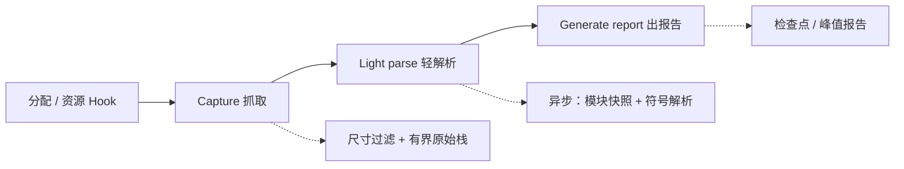

# liballoc_hook

`liballoc_hook.so` 是面向 Android、OpenHarmony（OHOS）和 glibc Linux 的原生
内存分配追踪库。它拦截原生分配及选定资源 API，记录存活分配和原始 native
PC，并生成检查点或峰值报告。

[English README / 英文 README](README.md)

## Hook 流程

拦截路径做三件事，分三段进行，只有第一段跑在分配线程上：



- **Capture（抓取）**——在分配线程上。先按尺寸过滤，再抓一份有界的原始 PC 栈
  （Fast 模式用帧指针回溯，Accurate 模式用 OS 后端）。不做模块查找、不做符号化、
  不做动态分配。
- **Light parse（轻解析）**——在 worker 线程上。对原始栈去重，快照已加载的 ELF
  模块，解析动态符号名；符号不可用时保留原始 PC 和模块相对 PC。
- **Generate report（出报告）**——按需的检查点，或退出时的峰值报告。

成功的 `malloc`/`new`、匿名 `mmap` 和选定资源分配 `ioctl` 事件共享统一原始栈契约；
释放路径复用已有的分配身份。

## 架构

实现由平台无关契约和平台后端组成，上面三段流程对应到这些部件：

- **Capture。** `CaptureStack()` 返回项目自有的 `RawStackRecord`，含抓栈状态、模式、
  后端、终止错误、跳过帧数、模块代号和有界 PC。Fast 在 aarch64 上用有界帧指针回溯
  （帧指针回溯不可用时退回 `_Unwind_Backtrace`）；Accurate 选择明确的 Android、Linux
  或 OHOS 后端，并保留部分栈及错误状态。核心契约是原生 C/C++ 和当前线程；托管运行时栈、
  远程线程上下文和完整离线 DWARF 展开属于未来的可选能力。
- **Light parse。** `AsyncStackPipeline` 按原始 PC 和模块代号去重，在 worker 中通过
  `dl_iterate_phdr` 快照已加载 ELF 段，并用 worker 侧 `dladdr` 解析动态符号名。它始终
  保留原始 PC 和模块相对 PC，不承诺完整的 DWARF 或离线符号化。队列容量、去重、丢弃和
  已处理结果通过 `AsyncStackStats` 暴露；hook 边界用 `AsyncStackWorkerThread()`，使解析器
  自身的分配不被跟踪。
- **报告地址。** 抓到的 PC 都是返回地址，因此报告中的模块相对 PC 会先回退到调用指令，
  再做模块归属。`#<n> <addr> <module>` 行上的地址是调用点的 ELF 虚拟地址，可直接交给
  `llvm-symbolizer --obj=<带符号的 ELF>`；每份报告的 `frame_pc:` 行都声明了这一约定。
- **记账。** `PointerData` 管理存活分配表、资源记账和峰值计数器。每个满足条件的分配都按
  精确尺寸跟踪；尺寸过滤（`BACKTRACE_MIN_SIZE`）是唯一的开销控制项。
- **平台边界。** CMake 分离 OS、libc、架构、编译器 unwind 能力和导出策略。mmap 拦截是一个
  由 `ENABLE_MMAP_HOOK_EXPORT` 控制的统一能力，Android 和 glibc Linux 默认开启，OHOS 默认
  关闭以减少 loader 和厂商运行时受到的影响。只有在构建了 DMA 抓取时才导出资源 hook。

## 文档

| 文档 | 覆盖内容 |
| --- | --- |
| [`docs/get_hook_report.zh-CN.md`](docs/get_hook_report.zh-CN.md) | 两类 hook 行为——只观测探测模式与两种报告模式——以及如何读报告。 |
| [`docs/EXAMPLE.zh-CN.md`](docs/EXAMPLE.zh-CN.md) | 构建前提、构建、预加载部署、检查点、故障排查和已知限制的端到端说明。 |
| [`docs/GPU_MEMORY_ACCOUNTING.zh-CN.md`](docs/GPU_MEMORY_ACCOUNTING.zh-CN.md) | GPU 设备内存如何记账、哪条驱动路径落在哪个信号里、以及厂商 API 的坑。 |

英文入口：[`README.md`](README.md)、[`docs/get_hook_report.md`](docs/get_hook_report.md)、
[`docs/EXAMPLE.md`](docs/EXAMPLE.md) 和
[`docs/GPU_MEMORY_ACCOUNTING.md`](docs/GPU_MEMORY_ACCOUNTING.md)。

## 配置项

所有配置都在下面两张表里。除此之外没有其他开关：没有列在这里的行为就是不可调的。

### 构建选项（CMake）

| 选项 | 默认值 | 作用 |
| --- | --- | --- |
| `MALLOC_HOOK_ENABLE_DMA_CAPTURE` | `ON` | 在 `malloc`/`mmap` 之外同时抓取 DMA-BUF/ION/GPU buffer（拦截 `ioctl`/`close`）。只有在没有任何驱动 UAPI 的宿主 smoke 构建里才关闭；真机上流水线的大部分内存都是 DMA，关掉会让报告看起来几乎是空的。它只控制被跟踪的拦截——实测内存采样器无论如何都从 `/proc` 读取 dmabuf。 |
| `ENABLE_MMAP_HOOK_EXPORT` | `ON`（Android/Linux）、`OFF`（OHOS） | 导出 `mmap`/`munmap`/`mremap` hook。一个平台无关的统一开关；OHOS 默认关闭以减少 loader 和厂商运行时受到的影响。关闭时 mmap 家族会从版本脚本里被剔除，链接器不会导出未编译进来的 hook。 |
| `MALLOC_HOOK_BUILD_TESTS` | `ON` | 构建测试程序并注册到 CTest。 |
| `MALLOC_HOOK_BUILD_GL_TESTS` | Android 上为 `ON` | 构建 Android OpenGL 集成测试。 |

`linux/dma-heap.h` 优先使用 sysroot 中的版本；没有时使用仓库内自带的一份 UAPI，因此缺少
该头文件的交叉工具链依然可以抓取 DMA。这一步不需要任何配置。

`build_android.sh`、`build_linux.sh` 和 `build_ohos.sh` 会在成功编译后打印实际生效的选项
和派生出的导出策略。手工使用 CMake 构建时，可运行
`cmake --build <build-dir> --target print_build_options` 查看同一份摘要。

### 运行选项（环境变量）

| 变量 | 默认值 | 作用 |
| --- | --- | --- |
| `DUMP_PEAK_VALUE_MB` | 未设置 | 正值下限选择**首次越线**模式：打开峰值记录和退出时导出，只保留峰值判据首次越过该 MB 数时的那一张快照。设为 `0` 表示关闭首次越线。 |
| `DUMP_PEAK_STEP_MB` | `0`（关闭） | 给正值并与 `ALLOC_HOOK_PEAK_SAMPLE_MS` 一起使用时选择**峰值追踪**；单独设置不起作用。表示重建峰值快照所需增长量的上限；小峰值使用 25% 增长量、下限 64 KB。首次越线模式下不生效。 |
| `ALLOC_HOOK_PEAK_SAMPLE_MS` | 宿主框架公布的间隔；开启峰值记录而框架未公布时为 `50` | 在独立线程上采样进程**实测**占用（`VmRSS` + dmabuf + 未被覆盖的 GPU 映射）的毫秒间隔。**只设它一个即选择只观测探测模式**：测量并打印，不做跟踪。`0` 表示强制不起采样线程。 |
| `ALLOC_HOOK_DUMP_PREFIX` | `/data/local/tmp/trace/backtrace_heap` | 报告路径前缀。文件名为 `<prefix>.exit.pid_<pid>.time_<t>.txt`。 |
| `BACKTRACE_MIN_SIZE` | OHOS 为 `40960`；其他平台开启峰值记录时为 `1024`，否则为 `0` | 小于该尺寸的分配不抓堆栈。最主要的开销控制项：典型流水线里它会过滤掉 99% 以上的分配。 |
| `ALLOC_HOOK_CAPTURE_MODE` | `fast` | `fast` = 在分配线程中只抓有界原始 PC，不做符号化；worker 后续可解析动态符号。`accurate` = 使用操作系统特定后端。 |
| `ENABLE_HOOK_DEBUG` | 未设置 | 设为任意值即在 stderr 输出 hook 诊断信息（信号、unwind、ION/DMA 路径）。 |
| `MALLOC_HOOK_TRACE_ALLOC` | 未设置 | 输出 Perfetto atrace 标记（一个开关统管两类）：每个被跟踪分配一条 begin/end 异步 slice（`memory_<type>@<ptr>.h<hash>`，end 即释放时刻），以及每次峰值快照一条 `malloc_hook_peak_snapshot` slice + MiB 计数器。需 `/sys/kernel/tracing/trace_marker` 可写（root / SELinux permissive）且 Perfetto 配置抓 `ftrace/print`，否则自动 no-op。离线用 `scripts/build_perfetto_alloc_track.py` 消费。 |

触发报告的信号不可调：各平台使用其约定的 backtrace 信号（Android 为 Bionic 保留的
backtrace 信号，OHOS 为 `46`，其他平台为 `SIGRTMIN+6`）。

命名说明：`DUMP_*` 和 `BACKTRACE_*` 这些变量早于 `ALLOC_HOOK_*` 前缀，因为部署脚本依赖
它们，所以保持原样。

## 获取报告

设置了上面哪些变量，就完全决定了这次运行是哪一种：

- 什么都不设（裸 `LD_PRELOAD`）——**轻量 tracked 探测**：跟踪分配但不抓栈，退出时打印
  tracked 的 host / dma / total 峰值。足够轻，可顺手跑一遍看"hook 看到多少"，也是给
  `DUMP_PEAK_VALUE_MB` 定下限的自然方式。
- 只设 `ALLOC_HOOK_PEAK_SAMPLE_MS`——**只观测探测模式**：测量进程占了多少
  （`/proc` 的 rss / dma / gpu），不跟踪任何东西，退出时打印一段日志。
- 设 `DUMP_PEAK_VALUE_MB`（配 `ALLOC_HOOK_PEAK_SAMPLE_MS=0` 以 tracked 合计为判据）——
  **首次越线**：一份报告、一次栈遍历，回答首次越过下限时是谁占着内存。这是常用的报告模式。
- 设 `ALLOC_HOOK_PEAK_SAMPLE_MS` + `DUMP_PEAK_STEP_MB`——**峰值追踪**：一份描述运行期
  最大值的报告，每涨一个步长做一次栈遍历。

完整命令行、输出和每个报告字段的读法见
[`docs/get_hook_report.zh-CN.md`](docs/get_hook_report.zh-CN.md)。

## Perfetto 时间线与离线工具

设 `MALLOC_HOOK_TRACE_ALLOC=1`，若该次运行同时被 Perfetto 抓取（含 `ftrace/print`），
就能得到一条干净的 **"Memory Top Allocations"** 轨道：每个被跟踪分配一条 begin→free
slice（free 即释放时刻），外加一条 **`[memory hook] Peak`** 子轨道按 MiB 标出每次峰值。
`scripts/` 负责离线合成：

```
# 1) 符号化 dump -> 报告 + hash 映射（自动读 maps.json；-m 限制 top-N）
python3 scripts/process_memory_stack.py -f <backtrace_heap*.txt> -m 30 -r report.md --export-hash-map
# 2) 内存用量计数器（先把 CSV 裁到 trace 时间窗）
python3 scripts/merge_csv_to_perfetto.py --trace <trace.perfetto> --csv <mem_use.csv> --output overlay.perfetto
# 3) 分配生命周期 + 峰值（默认读 <hook_root>/hash_index_map.json）
python3 scripts/build_perfetto_alloc_track.py --trace overlay.perfetto --output final.perfetto
```

`process_memory_stack.py` 从 gitignore 的 `<hook_root>/maps.json` 读取工程符号化配置
（源码根、需排除的转发帧、pipeline 命名；schema 见 `scripts/maps.example.json`，可用
`$MALLOC_HOOK_MAPS` 指向别处）。文件缺失则退回通用行为。

**爬升模式**（`ALLOC_HOOK_PEAK_SAMPLE_MS` + `DUMP_PEAK_STEP_MB`，peak-chasing）每爬升一个
step 写一份 `<prefix>.step.<MB>MB.txt`，文件名即该段峰值大小——逐个喂给第 1 步即得每段
一份报告。**峰值模式**（`DUMP_PEAK_VALUE_MB`，首次越线）只产一份峰值报告。

## 打包分发（cpack）

版本号以仓库根 `VERSION` 为准（打 tag `v<VERSION>`）。平台构建后 `(cd <build> && cpack)`
产出 `malloc_hook-<版本>-<abi>.tar.gz`，布局为 `lib/liballoc_hook.so` + `scripts/*.py` +
`scripts/maps.example.json` + `README.md` + `VERSION`。`dist` 组件为 `EXCLUDE_FROM_ALL`，
不影响各平台 `build_*.sh` 自身的 `ninja install`。

## 支持的平台

| 能力 | Android | OHOS（默认） | OHOS（`ENABLE_MMAP_HOOK_EXPORT=ON`） | glibc Linux |
| --- | --- | --- | --- | --- |
| `malloc`/`free`/`calloc`/`realloc` | 支持 | 支持 | 支持 | 支持 |
| 对齐分配 API | 支持 | 支持 | 支持 | 支持 |
| `mmap`/`munmap` | 支持 | 不支持 | 支持 | 支持 |
| `ioctl`/`close` DMA 抓取 | 支持（默认） | 支持（默认） | 支持（默认） | 支持（默认） |
| 检查点报告 | 支持 | 支持 | 支持 | 支持 |

`ENABLE_MMAP_HOOK_EXPORT` 在 OHOS 上默认关闭，以减少 loader 和厂商运行时受到的影响。
只有在小型、可控的复现程序中才建议打开。

## 范围和安全

本项目追踪原生 C/C++ 分配活动。直接系统调用和未导出的厂商入口会绕过拦截。不要将生成的
报告或私有设备标识写入源代码文档。
