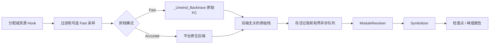

# liballoc_hook

`liballoc_hook.so` 是面向 Android、OpenHarmony（OHOS）和 glibc Linux 的原生
内存分配追踪库。它拦截原生分配及选定资源 API，记录存活分配和原始 native
PC，并生成检查点或峰值报告。

[English README / 英文 README](README.md)

## 通用 Hook 生命周期

拦截热路径只执行过滤、记账决策和有界 native 抓栈。模块查找、worker
线程中的 `dladdr`、符号化和报告格式化都在分配 Hook 之外执行。成功的
`malloc`/`new`、匿名 `mmap` 和选定资源分配 `ioctl` 事件共享统一原始栈契约；
释放路径复用已有的分配身份。

## 当前架构

实现由平台无关契约和平台后端组成：

- **Capture：** 当编译器运行时提供能力时，Fast 使用有界
  `_Unwind_Backtrace`。Accurate 选择明确的 Android、Linux 或 OHOS 后端，
  并保留部分栈及错误状态。
- **异步解析：** `AsyncStackPipeline` 对原始栈去重，在 worker 中快照已加载
  ELF 模块并解析动态符号；符号不可用时仍保留原始 PC 和模块相对 PC。
- **记账：** `PointerData` 管理存活分配身份、host 采样记账、资源记账和峰值
  计数器。
- **平台边界：** CMake 分离 OS、libc、架构、编译器 unwind 能力和导出策略。
  OHOS 的 `mmap` 拦截默认关闭。

详细架构契约见
[`docs/ARCHITECTURE.zh-CN.md`](docs/ARCHITECTURE.zh-CN.md)。核心范围是原生
C/C++ 和当前线程；托管运行时栈、远程线程上下文和完整离线 DWARF 展开属于
未来的可选能力。

## 使用说明

同语言使用说明是构建前提、构建、预加载部署、配置、检查点、故障排查和已知
限制的统一入口：

[`docs/USAGE.zh-CN.md`](docs/USAGE.zh-CN.md)

英文入口仍为 [`README.md`](README.md)、[`docs/ARCHITECTURE.md`](docs/ARCHITECTURE.md)
和 [`docs/USAGE.md`](docs/USAGE.md)。

## 支持的平台

| 能力 | Android | OHOS（默认） | OHOS（`OHOS_ENABLE_MMAP_HOOK=ON`） | glibc Linux |
| --- | --- | --- | --- | --- |
| `malloc`/`free`/`calloc`/`realloc` | 支持 | 支持 | 支持 | 支持 |
| 对齐分配 API | 支持 | 支持 | 支持 | 支持 |
| `mmap`/`munmap` | 支持 | 不支持 | 支持 | 支持 |
| `ioctl`/`close` 资源 Hook | 可选构建特性 | 可选构建特性 | 可选构建特性 | 可选构建特性 |
| 检查点报告 | 支持 | 支持 | 支持 | 支持 |

OHOS 默认关闭 `mmap` 拦截，以减少 loader 和厂商运行时受到的影响。只有在
小型、可控的复现程序中才建议打开。

## 范围和安全

本项目追踪原生 C/C++ 分配活动。采样会改变 host 分配归因，但不会改变资源
记账。直接系统调用和未导出的厂商入口会绕过拦截。不要将生成的报告或私有
设备标识写入源代码文档。
